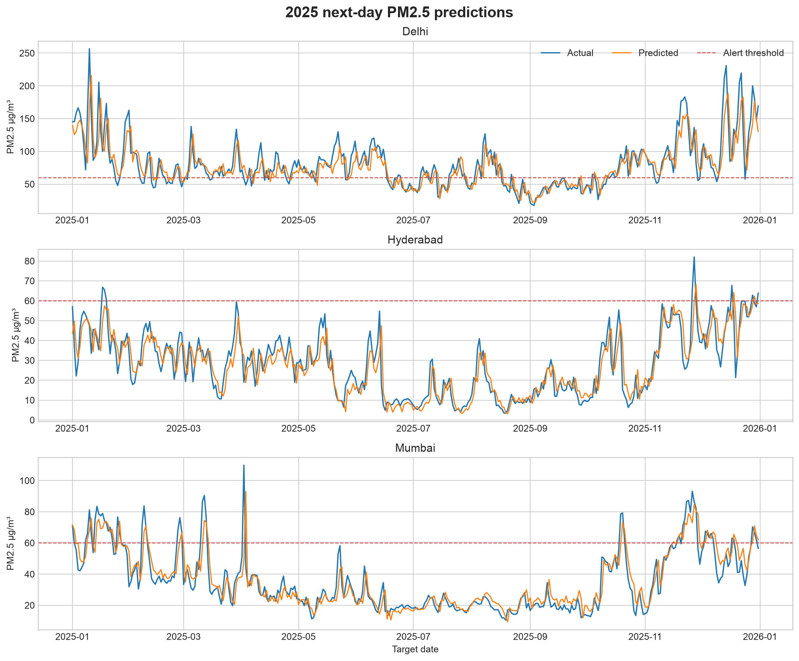
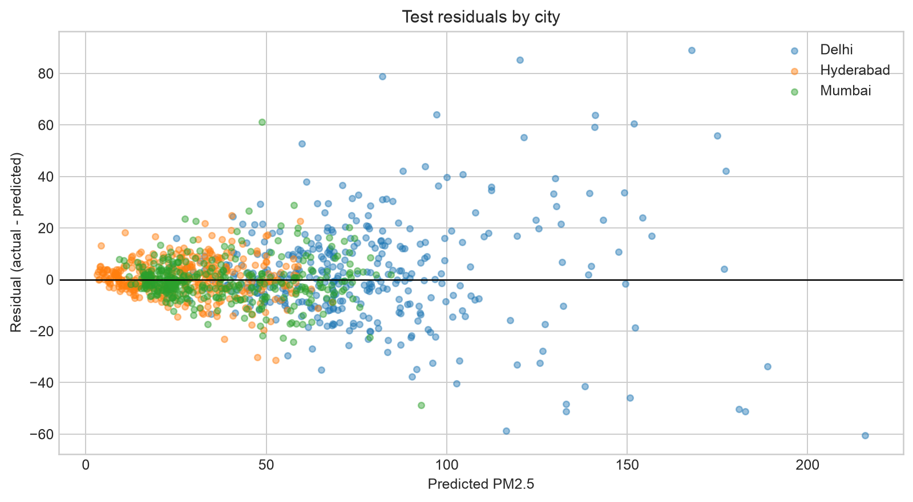

# India Metro Air Quality Forecasting

Next day PM2.5 forecasting for Delhi, Mumbai, and Hyderabad using daily air quality, weather, seasonal, and lag features. This compact machine learning project focuses on temporal validation, baselines, explainability, and honest error analysis.

[](https://github.com/divyarachala1812/india-metro-air-quality-forecasting/actions/workflows/ci.yml)
[](pyproject.toml)
[](LICENSE)

| Project detail | Value |
|---|---|
| Author | Divya Rachala |
| Cities | Delhi, Mumbai, and Hyderabad |
| Analysis period | 1 August 2022–31 December 2025 |
| Forecast target | Next day daily mean PM2.5 concentration |
| Project type | Machine learning |

**Quick navigation:** [Results](#result-summary) · [Evaluation gallery](#evaluation-gallery) · [Method](#method) · [Testing](#testing-and-reproducibility) · [PDF report](reports/India_Metro_Air_Quality_Forecasting_Report.pdf)

## Problem, root cause and purpose

City level PM2.5 can change quickly, and a useful next day estimate must respect time order. The main modelling risk is leakage: a random split can place neighbouring dates in both training and testing and make the result look stronger than it is. A second risk is selecting a complex model without comparing it with the simple rule that tomorrow may resemble today.

I built this project to test whether a compact model can improve on that persistence baseline for Delhi, Mumbai and Hyderabad. The project creates a daily city panel, uses only past information for lag and rolling features, selects a model on a chronological validation period, evaluates once on unseen 2025 data, and explains the remaining city level errors.

The work covers seven practical tasks.

1. Acquire and document India specific environmental data.
2. Convert hourly pollutant values into a consistent daily panel.
3. Create lag, rolling window, weather, city and seasonality features.
4. Prevent future information from entering training rows.
5. Compare learned models with a persistence baseline.
6. Evaluate concentration error and a declared alert threshold.
7. Explain where the model works, where it struggles and what data would improve it.

## Result summary

The selected Ridge model was chosen on the July–December 2024 validation period and evaluated once on the unseen 2025 test period.

| Metric | Selected model | Persistence baseline |
|---|---:|---:|
| Test MAE | **8.50 µg/m³** | 8.92 µg/m³ |
| Test RMSE | **13.45 µg/m³** | 14.93 µg/m³ |
| Test R² | **0.851** | 0.817 |
| Alert recall | **0.871** | 0.845 |
| Alert F1 | **0.849** | 0.845 |

The learned model improves test MAE by about 4.7% relative to persistence. This is a useful but modest gain, which is a credible outcome for a one-day-ahead target dominated by yesterday's pollution level.

City-level error is unequal: Delhi is the hardest city (MAE 14.47), while Mumbai (5.63) and Hyderabad (5.39) are more stable. Hyderabad has almost no 2025 days above the chosen 60 µg/m³ alert threshold, so alert precision, recall, and F1 are reported as zero rather than treated as meaningful performance estimates.

## Evaluation gallery

| 2025 forecast trace | Candidate model comparison |
|---|---|
|  |  |
| Permutation importance | Residual diagnostics |
|  |  |

The gallery covers forecast fit, model selection, feature influence, and city-level error behaviour rather than presenting only the strongest aggregate score.

## Method

```text
Open-Meteo air quality + weather APIs
                │
                ▼
Hourly pollutants and daily weather by city
                │
                ▼
Daily panel → lag/rolling/seasonal features
                │
                ▼
Train through Jun 2024 → validate Jul–Dec 2024 → test on 2025
                │
                ▼
Persistence, Ridge, and histogram gradient boosting
                │
                ▼
MAE/RMSE/R² + PM2.5 alert precision/recall/F1 + permutation importance
```

The 60 µg/m³ alert boundary corresponds to the upper limit of the Central Pollution Control Board's PM2.5 **Satisfactory** band. It is used here as a binary modelling threshold, not as a replacement for the full Indian AQI calculation.

## Repository structure

```text
data/processed/       Reproducible daily city panel
docs/                 Dataset notes, model card, and analytical report
models/               Local trained model output (recreated by training)
reports/              Metrics, 2025 predictions, feature importance, and figures
scripts/              Download, training, and example prediction entry points
src/airwise/          Data, feature, and modelling code
tests/                Feature and repository contract tests
```

## Testing and reproducibility

| Quality gate | Latest verified result | Purpose |
|---|---:|---|
| Python tests | **3 passed** | Feature engineering and repository contracts |
| Ruff linting | **Passed** | Imports, correctness rules, and code consistency |
| Temporal split contract | **Passed** | Train through June 2024, validate in late 2024, test on 2025 |
| Baseline comparison | **Passed** | Selected model evaluated against persistence |
| Continuous integration | **Automated** | [GitHub Actions workflow](.github/workflows/ci.yml) |

Reproduce the complete project with:

```bash
uv sync
uv run python scripts/download_data.py
uv run python scripts/train_model.py
uv run python scripts/build_report.py
uv run pytest -q
uv run ruff check .
```

Run the small inference example after training:

```bash
uv run python scripts/predict_example.py
```

## Key design choices

- **A temporal holdout, not a random split.** Random splitting would allow near-identical adjacent days into both training and testing.
- **A persistence benchmark.** Predicting tomorrow with today's PM2.5 is difficult to beat and gives the model result context.
- **Simple model wins.** Ridge slightly outperformed the nonlinear candidate on validation and is easier to explain.
- **Two evaluation views.** Regression metrics judge concentration error; threshold metrics judge high-pollution warning behaviour.
- **No false precision.** This is modelled atmospheric data at a city coordinate, not a network of CPCB station observations.

## Evidence

- [Model metrics](reports/model_metrics.json)
- [2025 predictions](reports/test_predictions_2025.csv)
- [Permutation importance](reports/feature_importance.csv)
- [Dataset documentation](docs/dataset.md)
- [Model card](docs/model-card.md)
- [Project report](docs/project-report.md)
- [Illustrated project report (PDF)](reports/India_Metro_Air_Quality_Forecasting_Report.pdf)

## Responsible-use note

This is an educational forecasting project. It must not be used for health decisions, regulatory reporting, or emergency alerts. Production use would require calibrated station measurements, stronger forecast-time data controls, uncertainty intervals, drift monitoring, and review by air-quality specialists.

## Licence and attribution

Project code is licensed under MIT. API data are provided under CC BY 4.0 and require attribution to Open-Meteo and its upstream providers, including Copernicus Atmosphere Monitoring Service for air-quality fields. The CPCB AQI documentation is used only to define the Indian PM2.5 category boundary discussed in this project.
