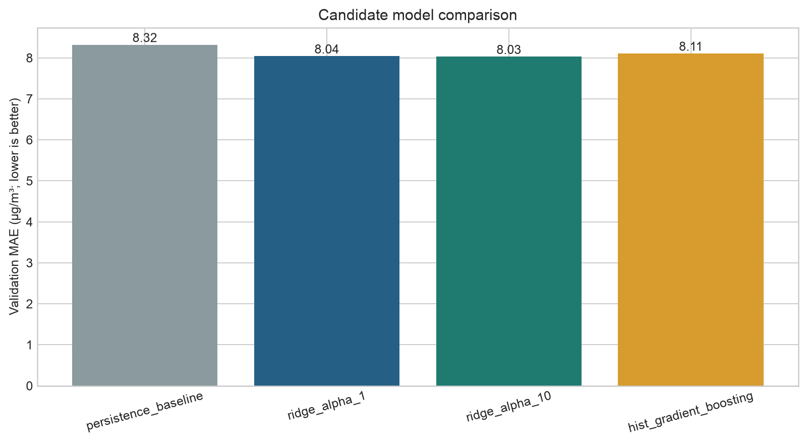
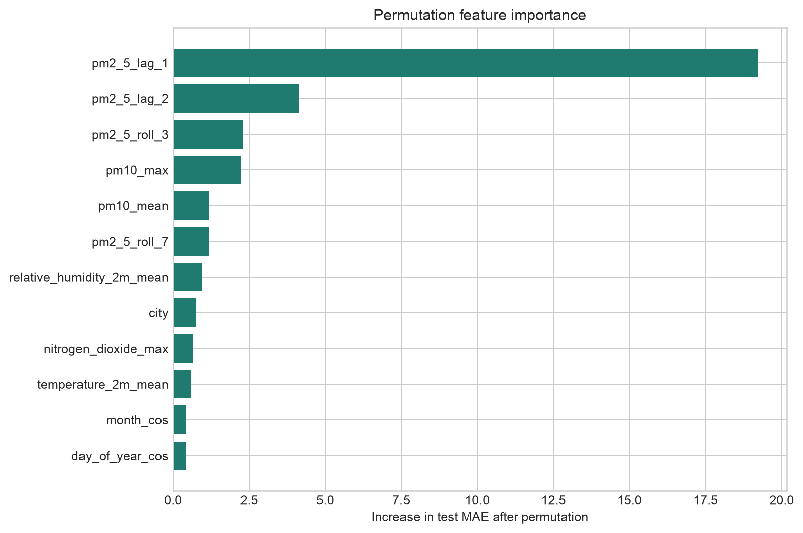

# Project report

## 1. Problem statement

The project asks a focused question: using information available through the end of a day, how accurately can a compact model estimate the next day's city-level mean PM2.5 for three major Indian metros?

The target is continuous because a concentration forecast preserves more information than a category label. A secondary alert view marks predictions above 60 µg/m³, the upper boundary of CPCB's Satisfactory PM2.5 band.

## 2. Data engineering

Hourly air-quality values are requested for one representative coordinate per city and converted into daily mean and maximum fields. Daily historical weather is joined on city and date. The processed panel contains 3,747 city-day records before lag windows and the unavailable final target day are removed.

The download script stores raw JSON locally, writes a checksum manifest, and creates one versionable processed CSV. This separation makes acquisition traceable while keeping the repository small.

## 3. Feature engineering

The most important forecasting signal is recent pollution. The model therefore receives today's PM2.5, the prior two days, three- and seven-day rolling means, and seven-day variability. PM10, nitrogen dioxide, ozone, and weather describe the current operating environment. Cyclical time features capture recurring seasonality without treating December and January as far apart.

Feature construction is grouped by city so lag values never cross city boundaries. The next-day target is also shifted within city.

## 4. Validation design

Air-quality observations are autocorrelated. A random row split would place adjacent dates in training and test sets and create an optimistic estimate. The project instead uses chronological partitions:

- training through 30 June 2024;
- validation from 1 July through 31 December 2024;
- final test from 1 January through 31 December 2025.

Candidate selection uses only validation MAE. The chosen model is then refit on training plus validation data and evaluated once on 2025.

## 5. Baseline and candidates

Persistence predicts tomorrow's PM2.5 as today's value. It is a strong, relevant baseline for a slowly changing environmental signal.

Two Ridge settings test a stable linear relationship after scaling and city encoding. Histogram gradient boosting tests whether nonlinear thresholds and interactions improve performance. Ridge alpha 10 wins validation by a narrow margin, supporting the simpler choice.

## 6. Results

On 2025, the selected model reaches MAE 8.50 µg/m³, RMSE 13.45 µg/m³, and R² 0.851. Persistence reaches MAE 8.92 and R² 0.817. The learned model therefore improves average error while retaining high-pollution alert recall of 0.871.

Delhi drives most of the remaining error because it has higher concentrations and sharper changes. Mumbai and Hyderabad are easier in absolute-error terms. The aggregate alert score should not be read as uniform city performance because Hyderabad rarely crosses the threshold.

## 7. Interpretation

Recent PM2.5 and related pollutant history dominate. Weather and seasonality contribute additional adjustment. This is consistent with a next-day task: current atmospheric conditions contain most of the predictable signal, while abrupt emission or meteorological changes remain difficult.

The modest improvement over persistence is itself an important finding. The project does not claim that a complex model is transformative when the evidence shows an incremental gain.

## 8. Limitations

The source provides atmospheric model output rather than a citywide network of ground stations. One coordinate cannot represent roadside, industrial, residential, and suburban variation. Historical realised weather also gives a cleaner signal than would be available in a true forward-looking forecast; a production simulation should replace those inputs with weather forecasts issued at the prediction time.

The binary threshold is a convenience for evaluation, not the complete Indian AQI. No health or policy recommendation is produced.

## 9. Improvements

The next version would add CPCB station observations, spatial features, forecasted meteorology, holiday and crop-burning indicators, uncertainty intervals, and rolling-origin backtests. A city-specific model could be compared with the shared multi-city model once enough history is available.

## 10. Skills demonstrated

This project demonstrates reproducible data acquisition, pandas feature engineering, scikit-learn pipelines, chronological validation, model selection, baseline comparison, regression and threshold metrics, permutation importance, error analysis, testing, linting, documentation, and responsible interpretation.
